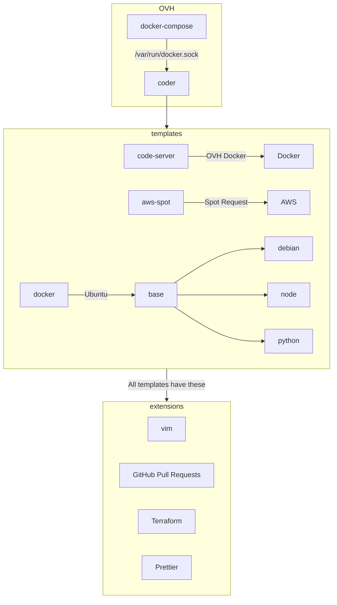

# docker-code-server

My version of code-server in Docker

# Procedure

1. Update the password, git config email, and git config name in `config/config.yaml`
2. Run `docker-compose up -d --build` to build a new image
3. Access via `https://[ServerIp]:8080`

# Docs
- https://github.com/coder/code-server
- https://hub.docker.com/r/linuxserver/code-server

# Diagram

